# Wazuh SIEM Lab

Open-source SIEM with Windows and Linux agents, three MITRE ATT&CK attack simulations, and compliance mapping to PCI DSS and CIS Benchmark.

---

## Architecture

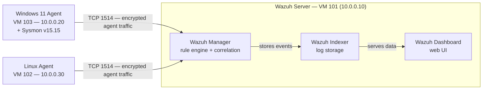

---

## What this is

I deployed Wazuh 4.9 as an all-in-one installation — manager, indexer, and dashboard on a single VM — and connected two agents: a Windows 11 VM running Sysmon and a Linux VM. Once both agents were reporting, I ran three attack simulations and verified that Wazuh detected each one, mapped them to MITRE ATT&CK techniques, and surfaced them in the dashboard.

The goal was to build hands-on experience with how a SIEM ingests logs, correlates events, and fires alerts — not just install the software.

---

## Lab environment

| Component | Details |
|---|---|
| Wazuh version | 4.9 (all-in-one) |
| Wazuh VM | VM 101, 10.0.0.10, Proxmox |
| Windows agent | VM 103, 10.0.0.20, Windows 11, Sysmon v15.15 (SwiftOnSecurity config) |
| Linux agent | VM 102, 10.0.0.30 |
| Network | Isolated lab — 10.0.0.0/24 behind OPNsense |

---

## What I built

### 1. Wazuh all-in-one installation

Ran the Wazuh 4.9 all-in-one installer on the dedicated VM. This single command installs and configures the Wazuh manager (event correlation and rule engine), the Wazuh indexer (OpenSearch-based storage), and the Wazuh dashboard (web UI). After install, I verified all three services were active before proceeding.

### 2. Windows agent with Sysmon

Installed the Wazuh agent on the Windows VM and registered it with the manager. Separately installed Sysmon v15.15 using the SwiftOnSecurity config file. Sysmon captures process creation, network connections, and file events at a level of detail that Windows Event Logs alone don't provide. The Wazuh agent picks up Sysmon logs and forwards them to the manager.

The reason I used Sysmon: without it, encoded PowerShell execution and process injection are much harder to detect. Sysmon's EventID 1 (process creation) logs the full command line including encoded arguments.

### 3. Linux agent

Installed and registered the Wazuh agent on the Linux VM. This gave visibility into auth logs, syslog, and any file integrity monitoring on the Linux side.

### 4. CIS Benchmark SCA scan

Wazuh has a built-in Security Configuration Assessment module that runs CIS Benchmark checks automatically. The Windows VM scan returned:
- 125 passed
- 262 failed
- 32% compliance score

This is a realistic result for a default Windows install — it's not hardened. The scan output maps each failed check to a specific CIS control, which makes it useful for showing how to prioritize remediation.

### 5. Attack simulations

Once the environment was confirmed working, I ran three attack simulations against the Windows VM and verified Wazuh detected each one.

---

## Attack simulations

### Simulation 1 — Brute force (MITRE T1110)

**What I did:** Ran 21 failed RDP login attempts against the Windows VM.

**How Wazuh detected it:** Windows Security logs EventID 4625 (failed logon) for each attempt. After enough failures in a short window, Wazuh fired rule.id 60122 — authentication failure threshold exceeded.

**Why this matters:** A single failed login is noise. 21 failures in a short window is a brute force pattern. The rule correlates multiple events into a single alert, which is the core function of a SIEM.

**MITRE mapping:** T1110 — Brute Force / Credential Access

**PCI DSS mapping:** 10.2.4 — Invalid logical access attempts

---

### Simulation 2 — Local account creation (MITRE T1136.001)

**What I did:** Ran `net user hacker Password123! /add` on the Windows VM to create a local account.

**How Wazuh detected it:** Windows Security logs EventID 4720 (user account created). Wazuh fired rule.id 60109 immediately.

**Why this matters:** Attackers create local accounts to maintain persistence after initial access. A SIEM that doesn't alert on new account creation has a blind spot in one of the most common post-exploitation steps.

**MITRE mapping:** T1136.001 — Create Account: Local Account / Persistence

---

### Simulation 3 — Encoded PowerShell (MITRE T1059.001)

**What I did:** Ran a Base64-encoded PowerShell command: `powershell -EncodedCommand <base64 payload>`. The command downloaded and dropped an executable.

**How Wazuh detected it:** Sysmon EventID 1 captured the full process creation event including the encoded argument. Wazuh fired two alerts:
- rule.id 92057 — PowerShell execution with encoded command (level 12)
- rule.id 92213 — Executable dropped to disk (level 15)

**Why this matters:** Attackers encode PowerShell to bypass simple string-matching defenses. Level 15 is Wazuh's highest severity. Without Sysmon, the encoded command is invisible in standard Windows Event Logs. This is why Sysmon was installed first.

**MITRE mapping:** T1059.001 — Command and Scripting Interpreter: PowerShell / Execution

---

## Attack simulation summary

| Attack | MITRE Technique | Rule ID | Severity | PCI DSS |
|---|---|---|---|---|
| 21 failed RDP logins | T1110 — Brute Force | 60122 | Medium | 10.2.4 |
| Local account creation | T1136.001 — Create Account | 60109 | High | 10.2.5 |
| Encoded PowerShell | T1059.001 — PowerShell | 92057 + 92213 | Level 12 + 15 | 10.2.1 |

---

## Screenshots

### Setup phase

#### 1. Pre-install connectivity check
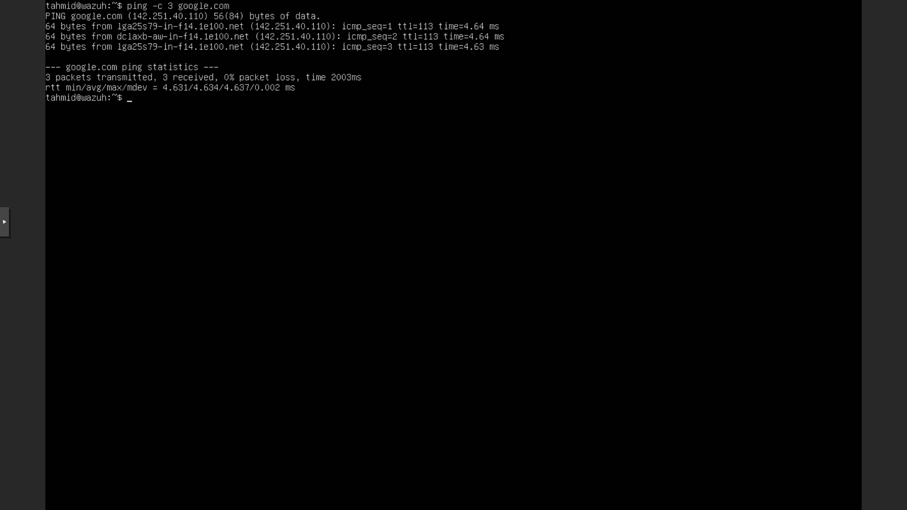

Pinged google.com from the Wazuh VM before installation to confirm internet access. The installer pulls packages from the internet, so this has to work first.

---

#### 2. All-in-one installation complete
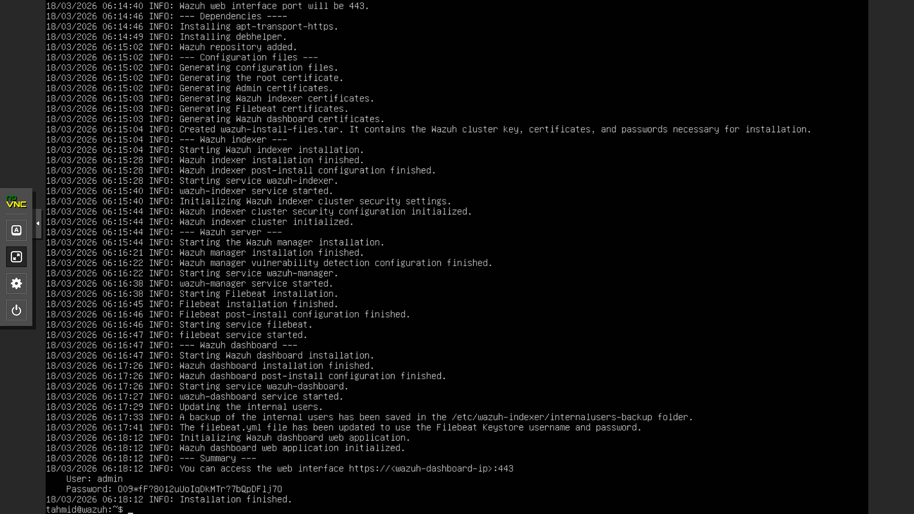

Wazuh 4.9 all-in-one installer finished. This single run installed the manager, indexer, and dashboard. The terminal output shows the generated admin credentials needed to log into the dashboard.

---

#### 3. All three services active
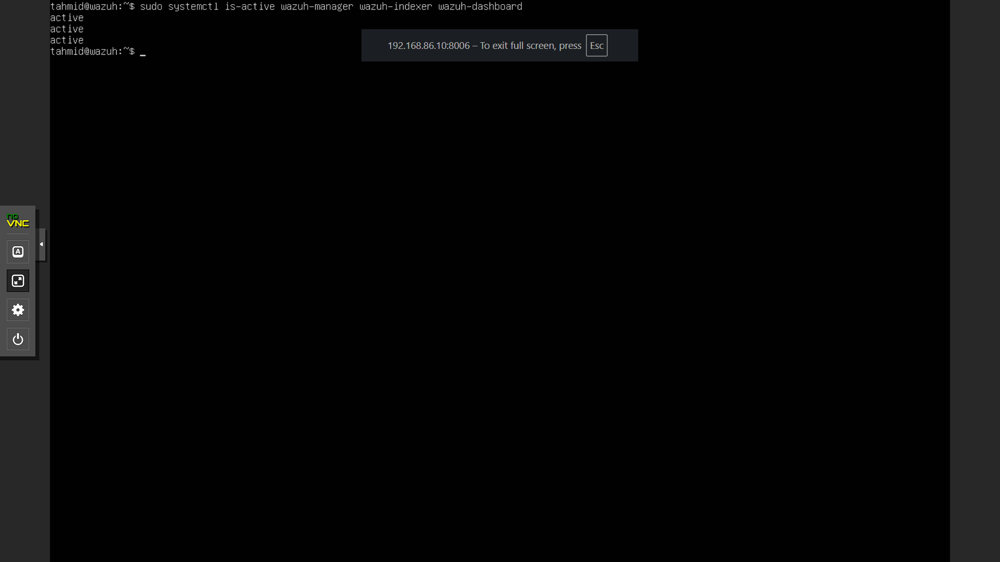

Ran `systemctl status` on all three Wazuh services after installation. Manager, indexer, and dashboard all showing active (running). If any of these are down, the dashboard either won't load or won't show any data.

---

### Agent setup

#### 4. Windows VM network troubleshooting
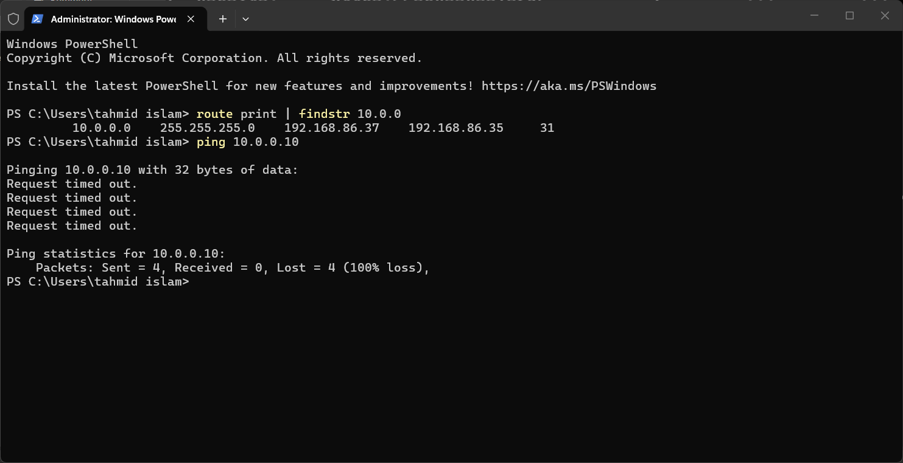

The Windows VM couldn't reach the Wazuh manager initially. This screenshot shows the failed ping — the agent can't register if it can't reach the manager's IP. I traced it to a Tailscale IP conflict and fixed it.

---

#### 5. Windows VM IP confirmed
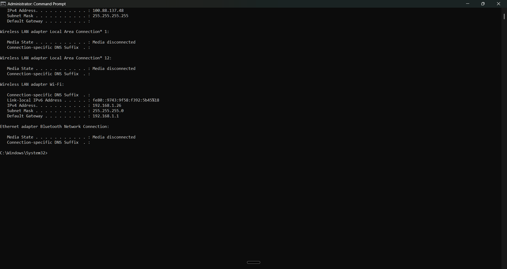

After troubleshooting, confirmed the correct IP on the Windows VM. The lab IP (10.0.0.20) is what the Wazuh agent needs to communicate with the manager at 10.0.0.10.

---

#### 6. Dashboard accessible, no agents yet
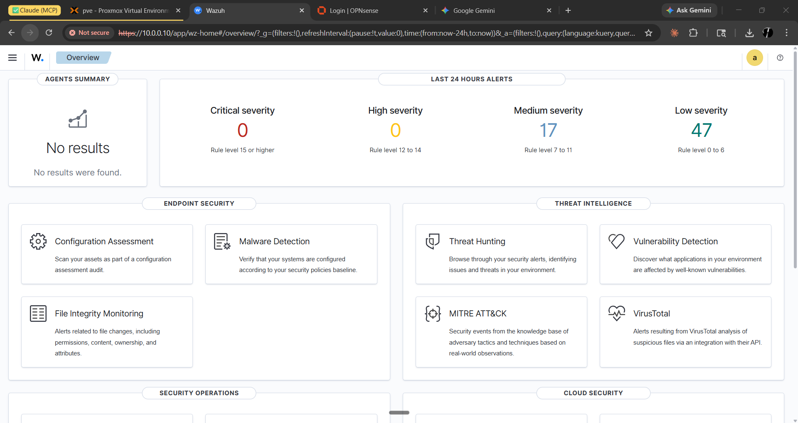

Wazuh dashboard loading before any agents are connected. Confirms the web UI is up and the indexer is responsive. The agent count shows zero — expected at this point.

---

#### 7. Windows agent active
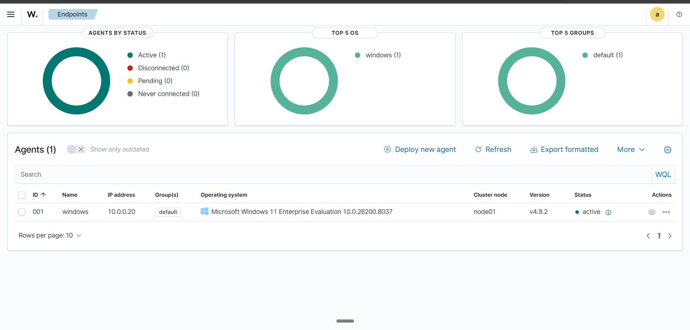

Windows agent registered and showing active in the dashboard at 10.0.0.20. From this point, all Windows events forwarded by the agent start appearing in the dashboard.

---

#### 8. Threat hunting — 130 total Windows alerts
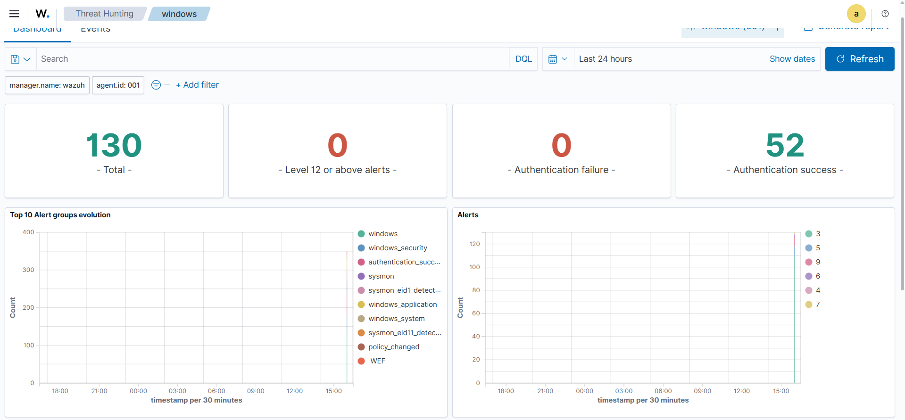

Threat Hunting view after the Windows agent has been running for a short time. 130 alerts just from normal Windows activity — login events, service starts, process creation. Most are informational; the point is the pipeline is working end to end.

---

#### 9. Top alert groups — PCI DSS mapping
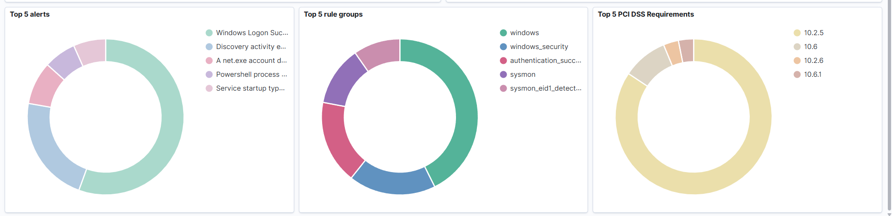

Alert breakdown by rule group. Wazuh automatically maps rules to compliance frameworks. PCI DSS 10.2 (audit log requirements) is showing up in the top groups from standard Windows login activity.

---

#### 10. 134 hits — Windows logon events
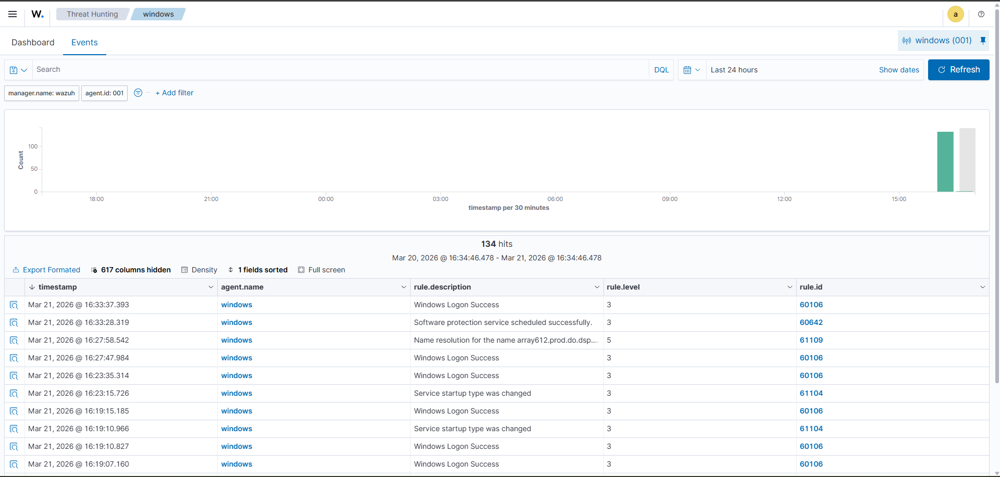

Filtered view showing 134 Windows logon events. This is the baseline noise before any attack simulation. Having this baseline makes it easier to spot anomalies later.

---

#### 11. MITRE, SCA, CIS Benchmark score
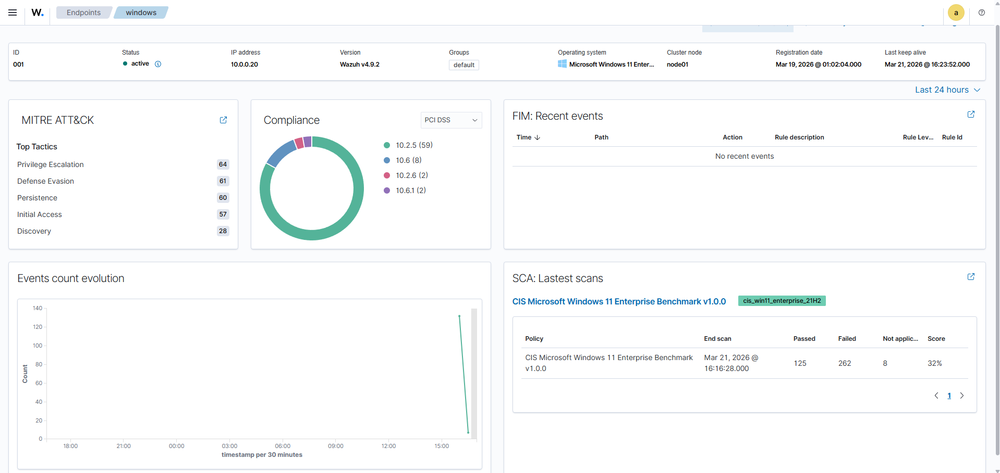

Windows VM CIS Benchmark SCA scan results: 125 passed, 262 failed, 32% compliance score. This is a default, unhardened Windows install — the score reflects that. Each failed check is mapped to a specific CIS control with a remediation recommendation.

---

#### 12. Both agents active
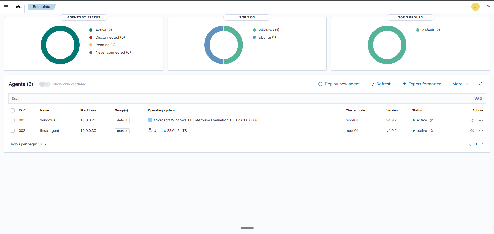

Both the Windows agent (10.0.0.20) and Linux agent (10.0.0.30) are showing as active. The environment is now ready for attack simulations.

---

### Attack simulations

#### 13. Brute force detection — rule 60122
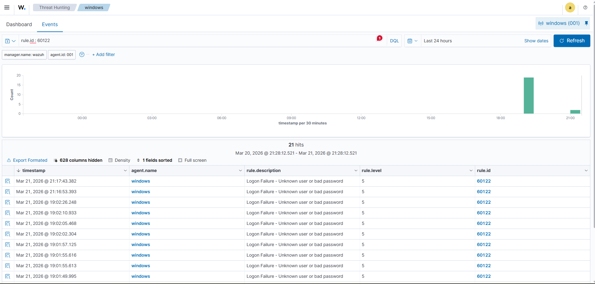

Wazuh alert for the brute force simulation. Rule 60122 fired after the failed RDP login threshold was crossed. The alert details show the source IP, the target account, and the event timestamp.

---

#### 14. Auth failure spike — 21 events
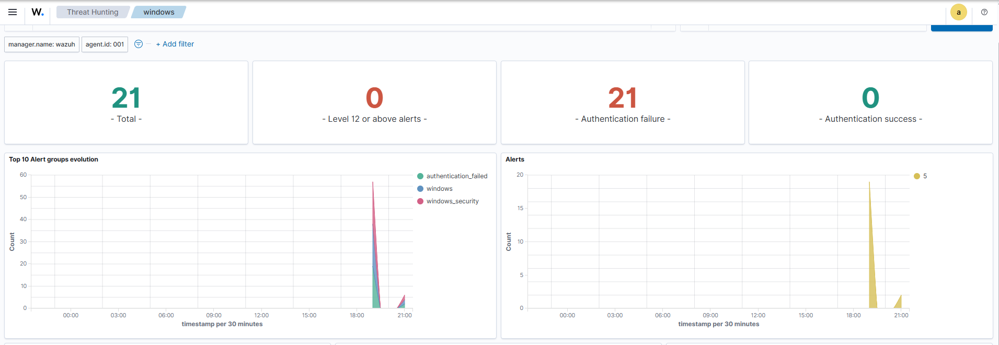

Timeline view showing the spike of 21 authentication failures in a short window. This is what a brute force pattern looks like in a SIEM — individual events that only make sense when viewed together.

---

#### 15. 466 total events, 8 high severity
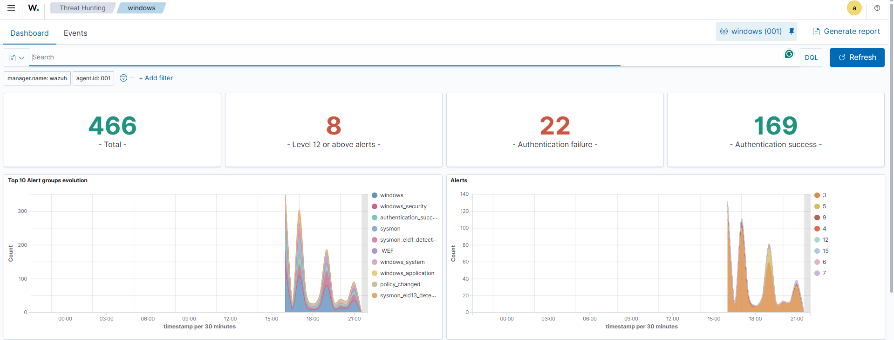

Total event count after running all three simulations: 466 events, 8 classified as high severity. The high-severity alerts correspond to the attack simulations.

---

#### 16. Alert document — full JSON view
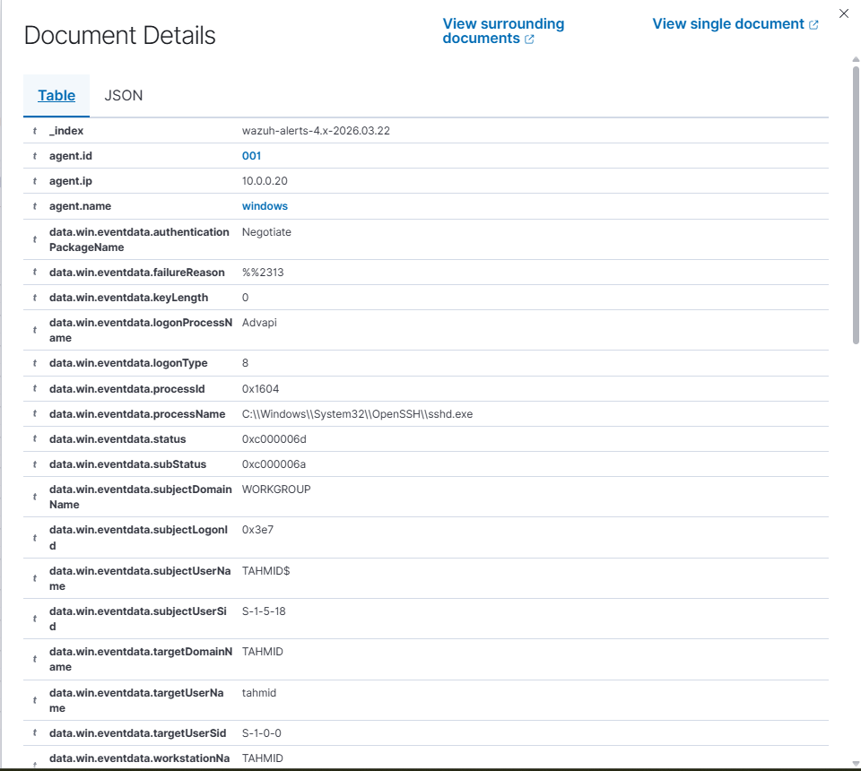

Raw JSON view of an alert document. This is what the indexer actually stores — the full event data including the rule details, MITRE technique ID, agent info, and original log. This is the data format used for SIEM integrations, threat hunting queries, and SOAR playbook inputs.

---

#### 17. Account creation — rule 60109
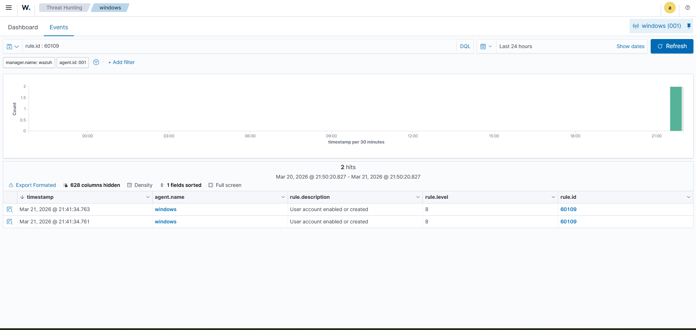

Wazuh alert for the `net user hacker` command. Rule 60109 fired from EventID 4720, showing the new account name and the user context it was created under. Fired within seconds of running the command.

---

#### 18. Encoded PowerShell — rule 92057
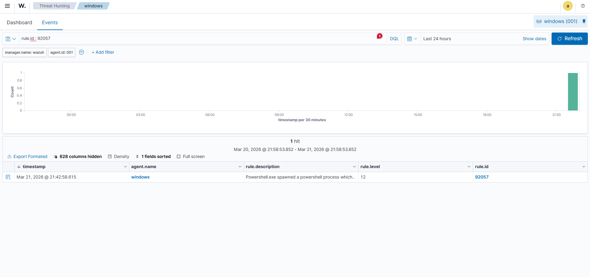

Wazuh alert for encoded PowerShell execution. Rule 92057 (level 12) from Sysmon EventID 1, capturing the full command line with the Base64-encoded argument. The alert includes the parent process (cmd.exe), the child process (powershell.exe), and the full encoded string — exactly the forensic detail needed to investigate a real incident.

---

## Security decisions

**Why Wazuh over a cloud SIEM?**
Wazuh runs on-prem, which means I control the data pipeline end to end. It's also the SIEM used in many DoD and defense contractor environments where cloud log forwarding isn't an option due to network restrictions. Understanding how to deploy and manage it on bare metal is more applicable than clicking through a managed service.

**Why Sysmon?**
Default Windows Event Logs miss too much. Process creation, encoded command lines, network connections initiated by processes — none of that is in Windows Security logs by default. Sysmon fills those gaps. The encoded PowerShell simulation would be completely invisible without it.

**Why run attack simulations instead of just installing the SIEM?**
Installing software proves you can follow documentation. Running attacks and validating detections proves the pipeline actually works — from endpoint event to Sysmon capture to agent forwarding to manager correlation to dashboard alert. If any link in that chain is broken, the attack won't show up.

---

## Skills demonstrated

- SIEM deployment (Wazuh 4.9 all-in-one)
- Agent deployment and registration (Windows + Linux)
- Sysmon configuration for enhanced Windows telemetry
- Attack simulation and detection validation
- MITRE ATT&CK mapping (T1110, T1136.001, T1059.001)
- Compliance mapping (PCI DSS 10.2, CIS Benchmark SCA)
- Log analysis and threat hunting in the Wazuh dashboard
- JSON alert structure and SIEM data formats
